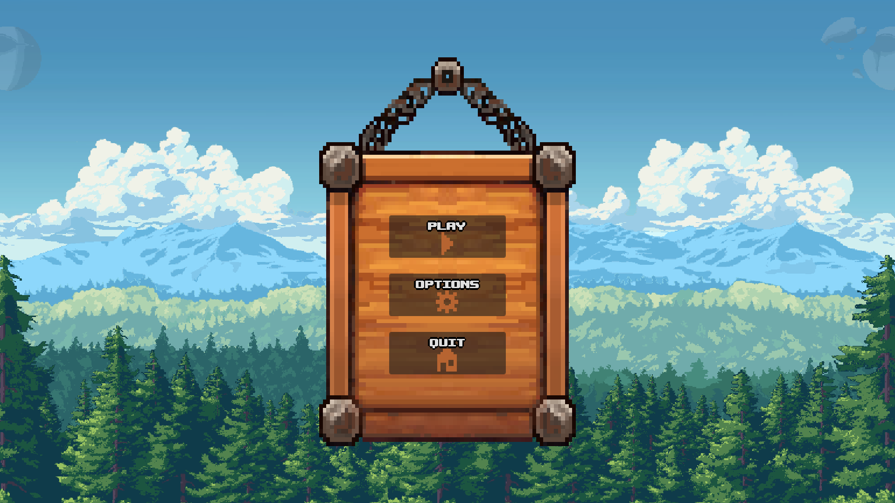
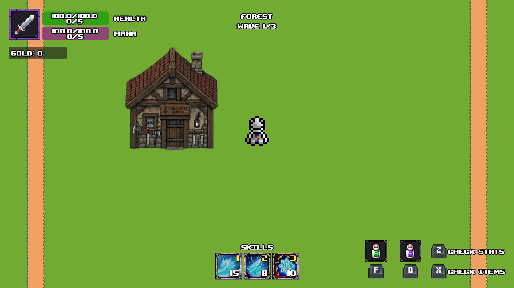
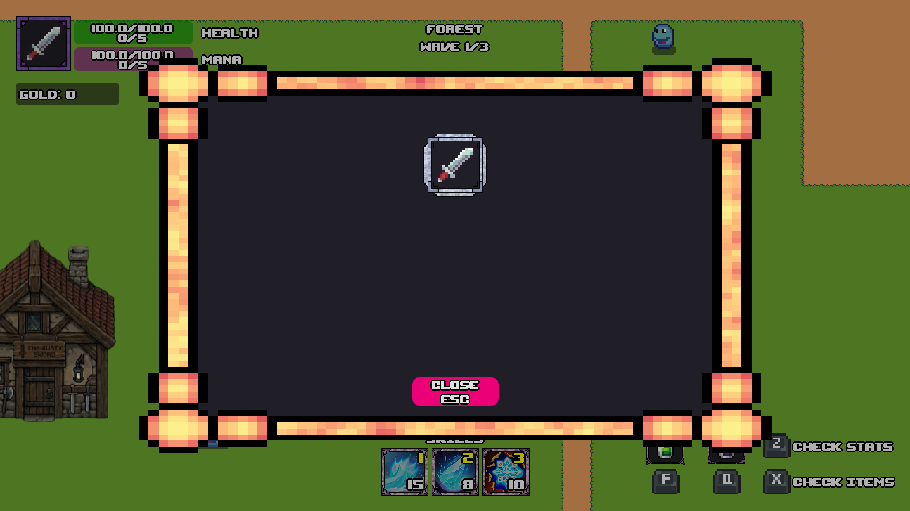
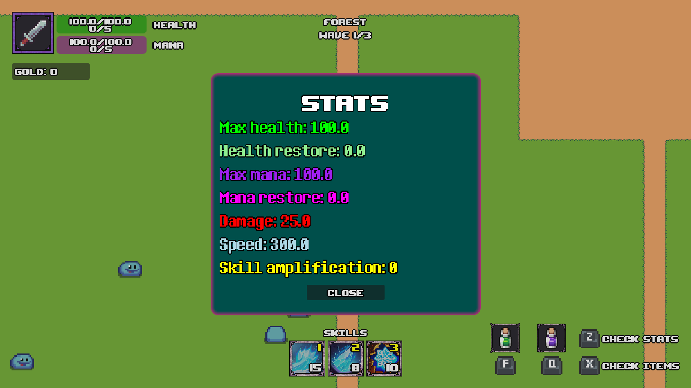
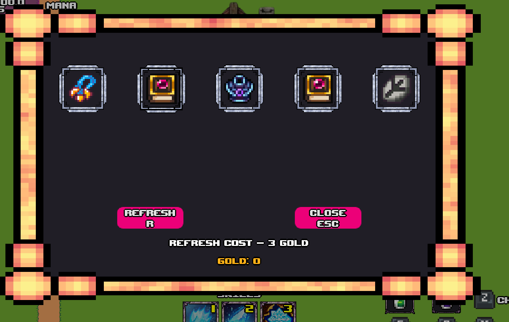
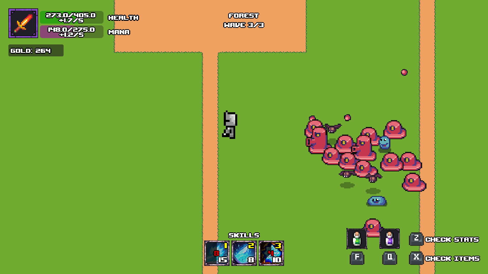
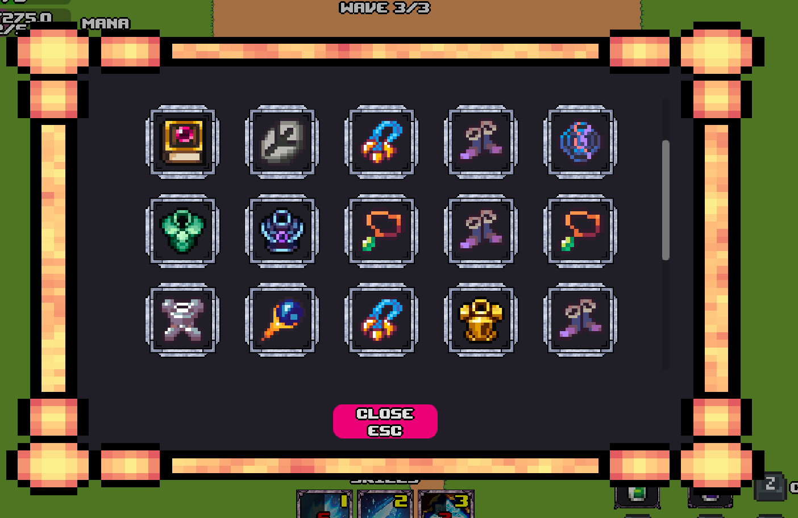
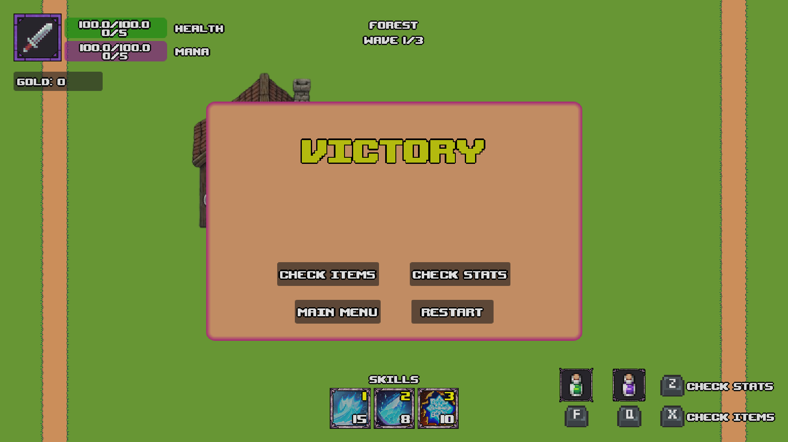
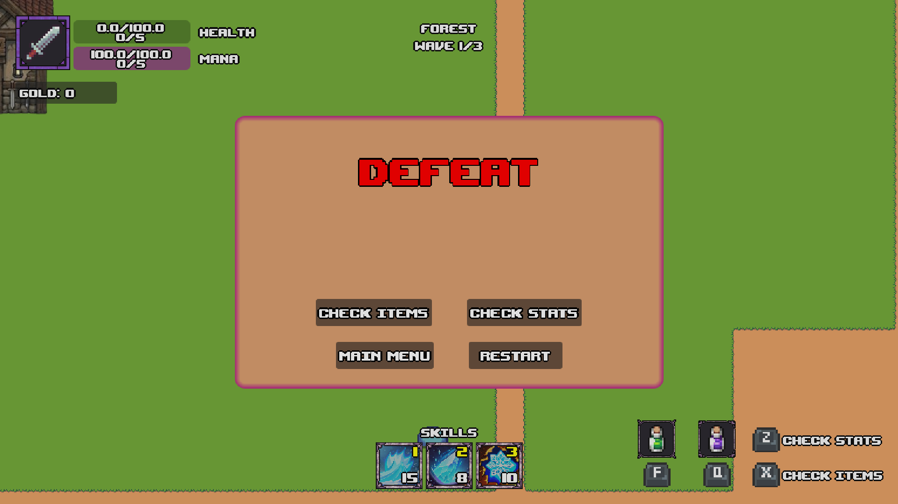

# Дипломний проект на тему: "Розробка гри на рушії Godot"

## Knight survivor
---
### Керування:
-  Переміщення - `W` `A` `S` `D`
-  Атака - `LMB` (ЛКМ), `SPACE`
-  Зілля лікування - `F`
-  Зілля мани - `Q`
-  Інвентар - `X`
-  Характеристики - `Z`
-  Пауза - `ESC`
### Скріншоти:

